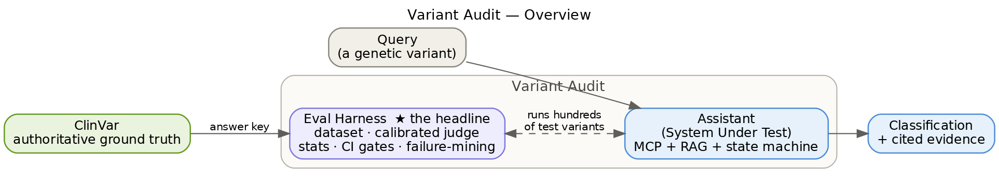

# Variant Audit

> **Status: in active development.** A clinical variant-classification assistant — and the eval harness that decides whether it's safe to ship. The assistant is the *system under test*; **the harness is the headline.**

Most people build AI demos. Almost no one builds the thing that tells you whether the demo is *right*. Variant Audit classifies genetic variants (pathogenic / uncertain / benign) with cited evidence — and wraps that agent in a rigorous evaluation harness graded against ClinVar: calibrated LLM-as-judge, statistically honest comparisons, CI release gates, and a production failure-mining loop.

Built on genomics deliberately — it's a domain with authoritative, verifiable ground truth (ClinVar), which is exactly what credible evals require.



Full design in [`../EvalForge_SPEC.md`](../EvalForge_SPEC.md) · build plan in [`../EvalForge_4week_plan.md`](../EvalForge_4week_plan.md).

---

## Getting started

### Prerequisites — install by tier (only what each phase needs)

macOS + [Homebrew](https://brew.sh). Don't install everything at once — Tier 1 is all you need to write the first line of code.

**Tier 0 — likely already have**
- [x] Homebrew
- [x] git
- [ ] **Python 3.11+** — verify: `python3 --version`. If older: `brew install python@3.12`
- [x] kubectl *(installed; not used until Week 4)*

**Tier 1 — needed to start (Day 1)**
- [ ] **Docker runtime** (to run Qdrant locally): `brew install colima docker` then `colima start`
- [ ] **Project Python deps** — see Quickstart below (`anthropic`, `ollama`, `langgraph`, `qdrant-client`, `sentence-transformers`, `fastapi`, `uvicorn`, `python-dotenv`, `typer`)
- [ ] **LLM — start local with Ollama (free):** `brew install ollama` → `ollama serve` (leave running) → `ollama pull llama3.1:8b`
- [ ] **Qdrant** (vector DB) — no install; runs as a container: `docker run -p 6333:6333 -v $(pwd)/data/qdrant:/qdrant/storage qdrant/qdrant`
- [ ] **Anthropic API key — later.** Only when you switch `LLM_PROVIDER=anthropic` for real eval runs. Create at [console.anthropic.com](https://console.anthropic.com), set a spend limit, paste into `.env`.

> **Local-first by design.** The code reads `LLM_PROVIDER` from `.env` — `ollama` (free, local) or `anthropic` (API). Develop on Ollama, then flip the flag to Claude for the numbers you actually quote. Keep the LLM call behind a single `complete()` function so the swap is one config change.
>
> **Model choice:** `llama3.1:8b` is a solid default (~5 GB; needs ≥8 GB RAM, comfortable at 16 GB). Browse [ollama.com/library](https://ollama.com/library) for current options. **Calibration caveat:** your judge's behavior depends on the model, so when you switch Ollama → Claude you must *re-run judge calibration* (Day 13) — that's a real lesson, not a chore.

**Tier 2 — Week 4 (local Kubernetes + observability)**
- [ ] `brew install kind` (local K8s cluster)
- [ ] `brew install helm` (for the kube-prometheus-stack chart)
- [ ] kubectl *(already have)*
- Prometheus + Grafana arrive as a Helm chart / containers — nothing to install directly.

**Tier 3 — cloud, OPTIONAL (only if you deploy to EKS)**
- [ ] `brew install awscli` then `aws configure`
- [ ] `brew install eksctl`

**Optional / nice-to-have**
- [ ] `brew install graphviz` — regenerate the architecture diagrams
- [ ] `brew install gh` — GitHub CLI, easy repo push
- [ ] **Hugging Face** — *not required.* The default embedding model (`all-MiniLM-L6-v2`) downloads anonymously via `sentence-transformers`. Only create an account + `huggingface-cli login` if you later use a gated model.

> **You do NOT need AWS CLI or a Hugging Face account to begin.** Start with Tier 1.

### Quickstart

```bash
# 1. clone + enter
git clone <your-repo-url> variant-audit && cd variant-audit

# 2. python env
python3 -m venv .venv
source .venv/bin/activate
pip install -r requirements.txt

# 3. config — defaults to LLM_PROVIDER=ollama, no API key needed to start
cp .env.example .env

# 4. start the local LLM (separate terminal)
ollama serve
ollama pull llama3.1:8b

# 5. start the vector DB (separate terminal)
colima start                  # if not already running
docker run -p 6333:6333 -v "$(pwd)/data/qdrant:/qdrant/storage" qdrant/qdrant
# Qdrant dashboard: http://localhost:6333/dashboard

# 6. sanity check (Day 1 exit gate): local model responds + Qdrant is reachable
ollama run llama3.1:8b "say hi in 3 words"
curl -s http://localhost:6333/healthz
```

### Day 1 done when
Your local model returns text (via Ollama) **and** Qdrant answers on `localhost:6333`. That's the environment exit gate — then move to Day 2 (RAG from scratch). Switching to the Claude API later is just `LLM_PROVIDER=anthropic` + a key.

---

## Planned structure

```
variant-audit/
├── README.md
├── requirements.txt
├── .env.example
├── src/variant_audit/
│   ├── config.py          # settings from env
│   ├── embeddings.py      # local sentence-transformers
│   ├── ingestion.py       # chunk + embed ACMG guidelines → Qdrant
│   ├── retrieval.py       # semantic search (RAG)
│   ├── mcp_tools/         # ClinVar, gnomAD, UCSC, AlphaMissense, Ensembl
│   ├── graph.py           # LangGraph state machine
│   ├── llm.py             # Claude wrapper (+ telemetry)
│   ├── telemetry.py       # OpenTelemetry setup
│   └── api.py             # FastAPI /ask
├── evals/                 # golden dataset, harness, CI gates
│   ├── golden_dataset.jsonl
│   ├── DATASET.md         # construction methodology + scoring rubric
│   └── run_evals.py       # the harness runner
├── infra/                 # docker-compose + observability configs (k8s/helm in Wk4)
└── data/                  # corpus + local stores (gitignored)
```

## Build arc (the progress tracker)

Each milestone has a clear "works when" gate and the files you touch. Check them off as you go.

| Wk | Milestone — "works when…" | Files |
|----|----------------------------|-------|
| 1  | **Local LLM call returns** (`complete("hi")` via Ollama) | `llm.py`, `config.py` |
| 1  | **RAG retrieves** the right ACMG passage | `embeddings.py`, `ingestion.py`, `retrieval.py` |
| 1  | **One MCP tool works** end to end (ClinVar) | `mcp_tools/clinvar.py` |
| 1  | **Thin slice**: one variant → cited classification | `api.py` (+ the above) |
| 2  | **State machine** runs the slice through LangGraph | `graph.py` |
| 2  | **All MCP tools** return structured evidence | `mcp_tools/*` |
| 2  | **Bounded loops** visibly trigger and terminate | `graph.py` |
| 3  | **Golden dataset** built + documented | `evals/golden_dataset.jsonl`, `evals/DATASET.md` |
| 3  | **`make eval`** prints a real accuracy number | `evals/run_evals.py` |
| 3  | **Calibrated judge** (measured kappa) | `evals/run_evals.py`, `JUDGE_CALIBRATION.md` |
| 3  | **CI gate** fails the build on quality regression | `.github/workflows/`, `evals/` |
| 4  | **Traces + metrics** in Grafana | `telemetry.py`, `infra/` |
| 4  | **Runs on Kubernetes** (kind) + nightly eval CronJob | `infra/k8s`, `infra/helm` |
| 5+ | **v2:** second agent (primer design) on the same harness | new module + `evals/` |

Switching off the local model to the Claude API for "real" numbers is one flag: `LLM_PROVIDER=anthropic` + a key.

## License
TBD.
