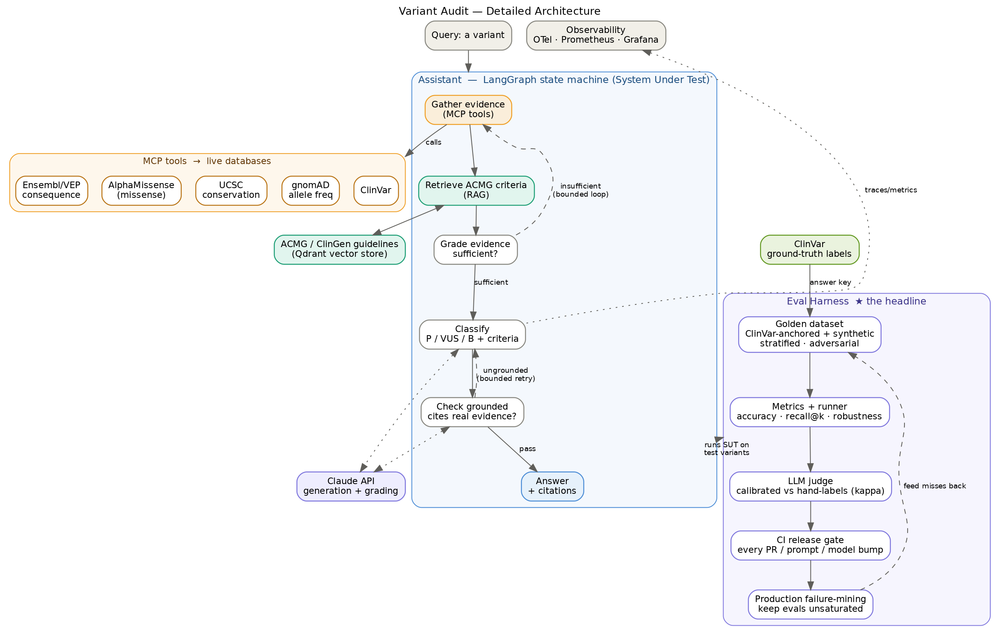
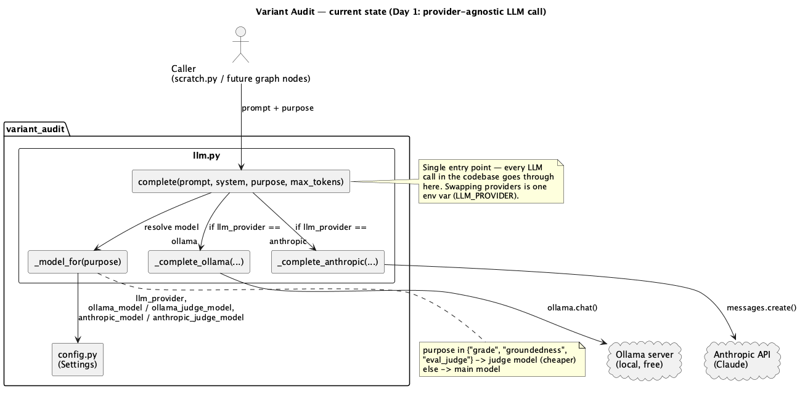

# Variant Audit

> A clinical variant-classification assistant — and the evaluation harness that decides whether it's safe to ship.
> **Status:** active development.

Variant Audit takes a genetic variant, gathers evidence from live genomic databases, reasons through the ACMG classification guidelines, and returns a classification (**pathogenic / uncertain / benign**) with cited evidence. Wrapped around that agent is the project's real focus: a rigorous **evaluation harness** — a calibrated LLM-as-judge, statistically honest comparisons, CI release gates, and a production failure-mining loop — that measures whether the agent can be trusted.

The agent is the *system under test*; the harness is the point. Genomics is a deliberate choice of domain: ClinVar provides authoritative, verifiable ground truth, which is exactly what credible evaluation requires.


## How it works

Three components, each doing a distinct job:

- **RAG — the rulebook.** Retrieval over the ACMG/ClinGen classification guidelines, so the agent reasons from the published standard rather than model memory.
- **MCP tools — the live evidence.** Each genomic data source is a callable tool: ClinVar (known assertions), gnomAD (population frequency), UCSC (conservation/genomic context), AlphaMissense (computational pathogenicity, missense), Ensembl/VEP (consequence).
- **State machine (LangGraph) — the reasoning workflow.** Evidence gathering, relevance grading, classification, and a groundedness check, connected by **bounded** correction loops that guarantee termination.

The eval harness grades the agent against ClinVar: classification accuracy with harm-weighted error costs, retrieval recall, judge-scored faithfulness, and robustness under input perturbation — gated in CI on every prompt and model change.



## Requirements

Built for macOS + [Homebrew](https://brew.sh).

**Core (to run locally):**
- Python 3.11+
- A container runtime — [Colima](https://github.com/abiosoft/colima) + Docker + Docker Compose (`brew install colima docker docker-compose`)
  - Homebrew's `docker-compose` formula doesn't register itself as a `docker` CLI plugin, so `docker compose` may fail with `unknown shorthand flag: 'f'`. Fix once: `mkdir -p ~/.docker/cli-plugins && ln -sfn "$(brew --prefix docker-compose)/bin/docker-compose" ~/.docker/cli-plugins/docker-compose`
- [Ollama](https://ollama.com) for local LLM inference (`brew install ollama`)
- Qdrant (vector store) — runs as a container, no install
- Python dependencies in `requirements.txt`

**LLM provider:** the app reads `LLM_PROVIDER` from `.env` — `ollama` (local, free, default) or `anthropic` (Claude API). Develop locally on Ollama; set `LLM_PROVIDER=anthropic` and add an `ANTHROPIC_API_KEY` for production-quality results.

**Optional (later phases):**
- `kind` + `helm` + `kubectl` — Kubernetes deployment with Prometheus/Grafana observability
- `awscli` + `eksctl` — cloud (EKS) deployment
- `plantuml` (`brew install plantuml`, pulls in `graphviz`/Java) — regenerate diagrams from `docs/diagrams/*.puml` via `make diagrams`

A Hugging Face account is **not** required — the default embedding model (`all-MiniLM-L6-v2`) downloads anonymously.

## Running it

```bash
# 1. clone + enter
git clone <your-repo-url> variant-audit && cd variant-audit

# 2. python environment
python3 -m venv .venv && source .venv/bin/activate
pip install -r requirements.txt

# 3. configure (defaults to local Ollama — no API key needed)
cp .env.example .env

# 4. start the local LLM (separate terminal)
ollama serve
ollama pull llama3.1:8b

# 5. start the vector store (separate terminal)
colima start
docker compose -f infra/docker-compose.yml up -d qdrant   # dashboard: http://localhost:6333/dashboard

# 6. verify the environment
ollama run llama3.1:8b "say hi in 3 words"
curl -s http://localhost:6333/healthz
```

Once the pipeline is implemented, the intended interface:

```bash
variant-audit ingest data/corpus          # chunk + embed the ACMG guidelines
variant-audit ask "BRCA1 c.68_69del"       # classify a variant
uvicorn variant_audit.api:app --reload     # serve POST /classify
make eval                                   # run the eval harness, print a scorecard
```

## Testing

```bash
make test   # or: python3 -m pytest tests/ -v
```

Unit tests mock the Ollama/Anthropic calls — no live server or API credits required. For a manual end-to-end smoke test against a real provider, run `python3 scratch.py` (requires `ollama serve` running and/or a valid `ANTHROPIC_API_KEY`).

## Project structure

```
variant-audit/
├── src/variant_audit/
│   ├── config.py          # settings from env
│   ├── llm.py             # provider-agnostic LLM call (Ollama | Anthropic)
│   ├── embeddings.py      # local sentence-transformers embeddings
│   ├── ingestion.py       # chunk + embed ACMG guidelines → Qdrant
│   ├── retrieval.py       # semantic search (RAG)
│   ├── mcp_tools/         # ClinVar, gnomAD, UCSC, AlphaMissense, Ensembl
│   ├── graph.py           # LangGraph state machine (the agent)
│   ├── telemetry.py       # OpenTelemetry traces + metrics
│   └── api.py             # FastAPI service
├── evals/                 # golden dataset, harness, scoring rubric, CI gates
├── infra/                 # docker-compose + observability configs (k8s/helm later)
├── roadmap/               # spec + 4-week plan
└── data/                  # corpus + local stores (gitignored)
```

## Current state (Day 1)

`llm.py` is implemented — the provider-agnostic LLM call every other component routes through. `complete()` picks a model via `_model_for()` (judge model for grading/judging purposes, main model otherwise) and dispatches to `_complete_ollama()` or `_complete_anthropic()` based on `LLM_PROVIDER`. Diagram source in [`docs/diagrams/llm_module.puml`](docs/diagrams/llm_module.puml) — regenerate with `make diagrams` after any architecture change.



## Roadmap

The build progresses from local LLM → RAG → MCP tools → state machine → **eval harness** → Kubernetes + observability, with a v2 extension that adds a second agent (primer design) evaluated by the same harness. Design rationale in [`roadmap/EvalForge_SPEC.md`](roadmap/EvalForge_SPEC.md); detailed plan in [`roadmap/EvalForge_4week_plan.md`](roadmap/EvalForge_4week_plan.md). Day-to-day progress is tracked on a Notion board.

## License

TBD.
